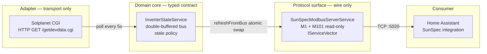

# Solar Home Gateway

A brand-agnostic **SunSpec Modbus TCP gateway** for the Solplanet ASW H-S2
series. Polls the inverter over HTTP CGI every 5 seconds and re-exposes the
readings as a SunSpec-conformant Modbus TCP server, so [Home
Assistant](https://www.home-assistant.io/)'s built-in SunSpec integration can
read it natively — no custom component required.

## Why

Most solar inverters ship with vendor-locked APIs. Solplanet is no exception:
its data lives behind an undocumented HTTP CGI endpoint. Re-publishing the
data over a standard, vendor-neutral protocol (Modbus + SunSpec) decouples
the inverter from the home-automation layer, so a future inverter swap is a
one-line config change instead of a Home Assistant rewrite.

## Table of contents

- [Architecture](#architecture)
- [Quick path](#quick-path)
- [Prerequisites](#prerequisites)
- [Installation](#installation)
- [Configuration](#configuration)
- [Running](#running)
- [Verifying](#verifying)
- [Home Assistant integration](#home-assistant-integration)
- [SunSpec model details](#sunspec-model-details)
- [Operating states](#operating-states)
- [Scale-factor math](#scale-factor-math)
- [Stale data handling](#stale-data-handling)
- [The adapter contract](#the-adapter-contract)
- [Troubleshooting](#troubleshooting)
- [Observability](#observability)
- [Security checklist](#security-checklist)
- [Development workflow](#development-workflow)
- [Adding a new inverter brand](#adding-a-new-inverter-brand)
- [Project layout](#project-layout)
- [License](#license)
- [References](#references)

## Architecture

Three layers, decoupled by typed contracts. The Modbus server **never** touches
HTTP, and the adapter **never** touches Modbus. The state bus is the only
object either layer is allowed to touch.



The type system enforces the seams:

- `InverterAdapter` exposes only `read(): Promise<InverterState>`. The
  concrete `SolplanetCgiAdapter` is bound via the `INVERTER_ADAPTER` DI
  token (`{ provide: INVERTER_ADAPTER, useExisting: SolplanetCgiAdapter }`).
  Swap the concrete class to add a new inverter brand — the rest of the
  system is unchanged.
- `SunSpecModbusServerService` exposes only Modbus handlers and never
  imports `@nestjs/axios`. If it ever needs network data, the seam is
  broken — push the call into a new adapter.

### The double-buffer swap

The Modbus server owns two register blocks (`bufA`, `bufB`). Each poll tick:

1. The adapter writes a fresh `InverterState` into the **inactive** buffer.
2. The service atomically flips `active` from `'A'` to `'B'` (or vice versa).

Because single-threaded JS makes the assignment truly atomic, a concurrent
Modbus read either sees the entire pre-write or the entire post-write block
— never a torn mix where, e.g., `W` is fresh but `W_SF` is stale. This is
critical because SunSpec clients pair a raw value with its scale factor in
the same read; a torn pair would silently corrupt the displayed value.

### Lifecycle

| Phase | Hook | What happens |
|---|---|---|
| Boot | `OnApplicationBootstrap` | Server seeds both buffers from `bus.snapshot()`, then binds the TCP socket |
| Steady state | `@Cron(EVERY_5_SECONDS)` | `adapter.read()` → `bus.publish()` → `modbus.refreshFromBus()` |
| Shutdown | `OnApplicationShutdown` | Server closes its socket within `SHUTDOWN_TIMEOUT_MS` (5 s) |

`enableShutdownHooks()` in `main.ts` is what wires SIGTERM/SIGINT into the
shutdown hook.

## Quick path

```bash
nvm use && corepack enable && pnpm install --frozen-lockfile
cp .env.example .env             # then set INVERTER_SN
pnpm run start:dev
```

The gateway binds Modbus on `:5020` and HTTP on `:3000`. Verify with:

```bash
curl http://localhost:3000/healthz          # {"status":"ok"}
```

Without a real inverter, the cron will warn every 5 s — that's the adapter
returning the offline state, not a crash.

## Prerequisites

| Tool | Version | Notes |
|------|---------|-------|
| Node.js | ≥ 24 (per `.nvmrc`) | LTS — use `nvm` or `fnm` |
| pnpm | 11.x (pinned via `packageManager`) | `corepack enable` activates it |
| OS | macOS / Linux | Windows not tested; native build skipped via `optional=false` |

## Installation

```bash
nvm use                 # honour .nvmrc
corepack enable         # activate pnpm@11 from packageManager field
pnpm install --frozen-lockfile
```

The `optional=false` line in `.npmrc` and the `allowBuilds` entries in
`pnpm-workspace.yaml` exist **only** to skip the `serialport@13` native
build. The gateway is TCP-only, so the native build would just waste time
and occasionally fail on macOS. Do not "fix" these without reading this
section first.

## Configuration

Copy `.env.example` to `.env` and edit. Every port is validated at boot —
out-of-range → the process crashes with a descriptive log line. This avoids
discovering the misconfiguration five minutes later when the Modbus server
fails to bind.

| Key | Default | Range | Purpose |
|-----|---------|-------|---------|
| `INVERTER_BASE_URL` | `http://192.168.1.50:8484` | `http(s)://...` | CGI base; `getdevdata.cgi` appended by the adapter |
| `INVERTER_DEVICE_ID` | `2` | — | Solplanet device id (query param) |
| `INVERTER_SN` | `""` (required) | non-empty | Inverter serial (query param) — empty string refuses to boot |
| `INVERTER_TIMEOUT_MS` | `4000` | > 0 | CGI wall-clock budget |
| `POLL_INTERVAL_MS` | `5000` | > 0 | Sched tick (decorator-fixed at 5 s in v1) |
| `POLL_TIMEOUT_MS` | `3000` | > 0 | Adapter-internal abort budget |
| `MODBUS_HOST` | `0.0.0.0` | — | **Must be a private interface in production** |
| `MODBUS_PORT` | `5020` | 1..65535 | Non-privileged |
| `MODBUS_UNIT_ID` | `1` | 1..247 | Modbus slave id (reported in `M1.DA`) |
| `STALE_AFTER_MS` | `30000` | > 0 | `snapshot()` stale threshold |
| `SHUTDOWN_TIMEOUT_MS` | `5000` | > 0 | Graceful close budget |
| `HTTP_PORT` | `3000` | 1..65535 | `/healthz` only |

> **Security note**: Modbus TCP has **no authentication and no encryption**.
> Anyone reachable on port 5020 can read (and, on a writeable gateway, set)
> the inverter state. Run the gateway on a trusted VLAN only; set
> `MODBUS_HOST` to a private interface in production (`192.168.1.x` or
> similar) and rely on network segmentation. Modbus TLS is out of scope
> for v1.

## Running

```bash
pnpm run start:dev     # ts-node, transpile-only (no hot reload)
pnpm run build && pnpm run start   # compiled JS, production-style
```

Expected log lines on first boot:

```
[Nest] ... LOG [Bootstrap] HTTP listening on :3000
[Nest] ... LOG [SunSpecModbusServerService] SunSpec Modbus TCP server bound to 0.0.0.0:5020 (unitID=1)
```

The poller then logs `inverter CGI http failed: ...` every 5 s if no
inverter is reachable — that's normal offline behaviour, not a crash.

## Verifying

### 1. HTTP liveness

```bash
curl http://localhost:3000/healthz
# {"status":"ok"}
```

`/healthz` is deliberately cheap — it answers as long as the Nest HTTP
server is up. It does **not** check whether the inverter is reachable; if
you need that signal, add a separate `/readyz` endpoint.

### 2. Modbus with `pymodbus`

```bash
python -m venv .venv && source .venv/bin/activate
pip install pymodbus==3.*
```

```python
from pymodbus.client import ModbusTcpClient
from pymodbus.payload import BinaryPayloadDecoder
from pymodbus.constants import Endian

c = ModbusTcpClient("127.0.0.1", port=5020)
c.connect()

# SunS magic at 40000-40001
suns = c.read_holding_registers(0, 2).registers
assert suns == [0x5375, 0x6E53], f"bad SunS magic: {suns!r}"

# M1 ID and L at 40002-40003
m1 = c.read_holding_registers(2, 2).registers
assert m1[0] == 1 and m1[1] == 68

# M101 ID and L at 40070-40071
m101 = c.read_holding_registers(70, 2).registers
assert m101[0] == 101 and m101[1] == 52

# M101.W (AC power, W) at 40084 with W_SF at 40085
w  = c.read_holding_registers(84, 2).registers
raw, sf = w[0], (w[1] - 0x10000) if w[1] > 0x7FFF else w[1]
print(f"AC power: {raw * 10**sf:.1f} W")

# M101.ST (operating state) at 40108
st = c.read_holding_registers(108, 1).registers[0]
# 1=OFF, 2=SLEEPING, 3=STARTING, 4=MPPT, 5=THROTTLED, 6=SHUTTING_DOWN, 7=FAULT, 8=STANDBY
print(f"Operating state: {st}")
```

### Address convention

`modbus-serial` v8 invokes our handlers with the **offset** (`addr − 40000`),
not the absolute Modbus address. So register `40084` (M101.W) is read as
`getHoldingRegister(84)`. The tables below use **absolute Modbus
addresses** (40000-based); subtract 40000 to get the offset that shows up
in handler calls.

## Home Assistant integration

Add the [SunSpec integration](https://www.home-assistant.io/integrations/sunspec/)
and point it at the gateway's host (`modbus:` → `host:` → port `5020`,
slave `1`). HA will discover the gateway automatically by reading the
SunS magic at 40000 and walking the model headers.

### Register map (verified against [sunspec/models](https://github.com/sunspec/models))

| Address | Field | Type | Notes |
|---------|-------|------|-------|
| `40000`–`40001` | SunS magic | `0x5375 0x6E53` | discovery sentinel |
| `40002` | M1.ID | uint16 | = 1 (Common) |
| `40003` | M1.L | uint16 | = 68 (model length in registers) |
| `40004`–`40019` | M1.Mn | string16 | vendor name, NUL-padded (32 chars) |
| `40020`–`40035` | M1.Md | string16 | model name (32 chars) |
| `40036`–`40043` | M1.Opt | string8 | options, zeroed in v1 |
| `40044`–`40051` | M1.Vr | string8 | version, zeroed in v1 |
| `40052`–`40067` | M1.SN | string16 | serial number (32 chars) |
| `40068` | M1.DA | uint16 | Modbus unit ID (from `MODBUS_UNIT_ID`) |
| `40069` | M1.Pad | uint16 | canonical even-alignment pad |
| `40070` | M101.ID | uint16 | = 101 |
| `40071` | M101.L | uint16 | = 52 |
| `40072` | M101.A | uint16 | AC current (A) |
| `40073`–`40075` | M101.AphA/B/C | uint16 | zeroed (single-phase) |
| `40076` | M101.A_SF | int16 | shared by A / AphA / AphB / AphC |
| `40077`–`40079` | M101.PPVphAB/BC/CA | uint16 | DC voltage phases (zeroed) |
| `40080` | M101.PhVphA | uint16 | AC voltage phase A (V) |
| `40081`–`40082` | M101.PhVphB/C | uint16 | zeroed (single-phase) |
| `40083` | M101.V_SF | int16 | shared by PhVph* and PPVph* |
| `40084` | M101.W | int16 | AC power (W) — **can be negative** for consumption |
| `40085` | M101.W_SF | int16 | |
| `40086` | M101.Hz | uint16 | grid frequency (Hz) |
| `40087` | M101.Hz_SF | int16 | |
| `40088`–`40093` | (VA / VAr / PF / DCA / DCV / DCW placeholder) | | zeroed |
| `40094`–`40095` | M101.WH | acc32 BE | lifetime energy (Wh) — divide by 1000 for kWh |
| `40096` | M101.WH_SF | int16 | typically 0 |
| `40097`–`40107` | (DC and temperature block) | | zeroed in v1 |
| `40108` | M101.St | enum16 | operating state (1..8) |
| `40109` | (pad) | | |
| `40110`–`40121` | (event bitfields) | | zeroed |
| `40122` | EOM sentinel | `0xFFFF` | end-of-models marker |
| `40123` | reserved | | zero padding |

Every register is **big-endian uint16** on the wire. Multi-register values
(`acc32`, strings) split the high word first.

## Operating states

`M101.St` is an enum16 — the numeric values ARE the SunSpec enum, not
arbitrary codes.

| Value | Name | Meaning |
|------:|------|---------|
| 1 | `OFF` | inverter not producing (night, fault, shutdown, stale) |
| 2 | `SLEEPING` | low-power standby, not feeding the grid |
| 3 | `STARTING` | wake-up / self-test sequence |
| 4 | `MPPT` | running and feeding the grid (most common daytime state) |
| 5 | `THROTTLED` | producing, but output is capped (grid rule, temperature, …) |
| 6 | `SHUTTING_DOWN` | graceful shutdown in progress |
| 7 | `FAULT` | error state — see inverter display for details |
| 8 | `STANDBY` | ready but not actively producing (e.g. grid absent) |

The adapter maps Solplanet's stringy `STATE` field (`"online"`, `"sleeping"`,
`"fault"`, …) onto these values, with the following rules:

- `online` / `mppt` / `running` / `grid-connected` / `normal` → `MPPT`
- `sleeping` / `standby` / `idle` → `SLEEPING`
- `starting` / `startup` / `init` → `STARTING`
- `fault` / `error` / `alarm` → `FAULT`
- anything else (including `off`, `shutdown`, `stopped`, empty) → `OFF`

## Scale-factor math

SunSpec represents every measurement as a `raw × 10^SF` pair, where `raw`
fits in int16 (`-32768..32767`) and `SF` is itself an int16. The math lives
in `src/modbus/scale-factor.ts`.

`encode(value)` returns `{ value: raw, scaleFactor: sf }`:

- **Whole numbers** → prefer `SF = 0` (no precision loss). If the value
  overflows at `SF = 0`, walk positive SFs (downgrade precision) until
  it fits or we hit `SF_CEIL = 10`.
- **Fractional values** → walk negative SFs (most precision first) until
  it fits or we hit `SF_FLOOR = -10`.
- **Overflow** at the floor → clamp `raw` to `INT16_MAX`.
- **Non-finite** (`NaN`, `Infinity`) → return `{ value: 0, scaleFactor: 0 }`.

Examples:

| Input | SF | raw | Decoded as |
|------:|---:|----:|-----------:|
| `0` | 0 | 0 | 0 |
| `230.5` (V) | -1 | 2305 | `2305 × 10⁻¹ = 230.5` |
| `4500` (W) | 0 | 4500 | `4500 × 10⁰ = 4500` |
| `50000` (W) | 1 | 5000 | `5000 × 10¹ = 50000` (downgraded) |
| `1e15` | -10 | 32767 | clamped to int16 max |

Clients must read `value` AND `scaleFactor` in the same Modbus transaction
— that's why the double buffer matters. Reading them separately can mix
two different poll ticks and produce nonsense.

## Stale data handling

`InverterStateService` (`src/state/inverter-state.service.ts`) is the
single source of truth for "is the data fresh?".

- **On every fresh publish** (`isStale: false`) → stamp `lastUpdatedAt = Date.now()` and update `lastGood`.
- **On a stale publish** (`isStale: true`, e.g. adapter hit an HTTP error) → preserve the previous `lastUpdatedAt` so the 30 s threshold keeps tripping. `lastGood` is **not** updated.
- **On `snapshot()`** after `STALE_AFTER_MS` (default 30 s) without a fresh publish → production fields are zeroed, `operatingState = OFF`, `isStale = true`, and `lastUpdatedAt = Date.now()`. **Identity fields** (`vendorName`, `modelName`, `serialNumber`) and `lifetimeEnergyKwh` are preserved from `lastGood` so the inverter stays identifiable during an outage.

The adapter may pass any `lastUpdatedAt` (typically `0`) — the bus stamps
the real one. This contract is what lets every adapter stay trivially
simple: it just returns the truth, the bus owns time.

## The adapter contract

`InverterAdapter` (`src/state/inverter-state.types.ts`) is the abstract
class every transport implements:

```ts
abstract class InverterAdapter {
  abstract readonly vendorName: string;
  abstract readonly modelName: string;
  abstract read(): Promise<InverterState>; // NEVER throws
}
```

**`read()` MUST NOT throw.** Every failure mode — HTTP timeout, non-2xx,
connection refused, malformed JSON, non-numeric values — must resolve to
an offline `InverterState` with `isStale: true`, `operatingState = OFF`,
zeroed production values, and identity preserved from config.

This contract is what keeps the cron trivial: it can `await` the adapter
without try/catch (one is included as belt-and-braces, but it should
never fire).

The Solplanet adapter (`src/gateway/inverters/solplanet-cgi.adapter.ts`)
implements this by:

- Using `firstValueFrom(http.get(...).pipe(timeout(...), catchError(...)))`
  with a wall-clock guard independent of the axios-level timeout, so a
  stalled TCP socket can't wedge the cron.
- Accepting both string and numeric `STATE` values (older firmware emits
  numeric codes, newer firmware emits strings).
- Coercing every numeric field via `toFiniteNumber()` so a stray string
  or `NaN` becomes `0` instead of poisoning downstream math.
- Falling back from `WH` to `E-Total` for lifetime energy (firmware
  versions alternate between the two keys).

## Troubleshooting

| Symptom | Likely cause | Fix |
|---------|--------------|-----|
| Process exits at boot with `INVERTER_SN is required` | `INVERTER_SN` is empty in `.env` | Set `INVERTER_SN=` to your inverter's serial number |
| Process exits with `MODBUS_PORT must be an integer in [1, 65535]` | Out-of-range port in `.env` | Check the port value (no extra chars, no negatives) |
| `port 5020 in use` at startup | Another process bound 5020 (often a `pymodbus` server, or a prior gateway instance) | `lsof -nP -iTCP:5020 -sTCP:LISTEN` to find the owner, or set `MODBUS_PORT` to 5021+ |
| Polling logs `inverter CGI http failed: ECONNREFUSED` every 5 s | Inverter is off / unreachable / wrong `INVERTER_BASE_URL` | Verify the inverter is on and reachable; `curl <base>/getdevdata.cgi?device=2&sn=<SN>` should return JSON |
| Polling logs `non-JSON or empty body` | A proxy or captive portal intercepted the request | Check the network path; the gateway never follows redirects (`maxRedirects: 0`) |
| Home Assistant sees the gateway but sensors stay `unknown` | HA polled during a stale window or before the first publish | Wait one poll cycle (5 s); HA will pick up the next snapshot |
| AC power reads as `0` even when the sun is shining | The adapter is in an offline window | Check the gateway logs for `No fresh data — marking state stale` |
| `M101.W` reads back the wrong value | A Modbus client read `W` and `W_SF` in two separate transactions | Read both in a single FC3 transaction — see the double-buffer note above |
| `pnpm test:e2e` fails with `Modbus server did not bind to 127.0.0.1:5021 within 5s` | Port 5021 is held by another process | `lsof -nP -iTCP:5021 -sTCP:LISTEN`; or set `MODBUS_TEST_PORT` to a free port |

## Observability

The gateway uses Nest's default logger. Useful log patterns:

| Pattern | Meaning |
|---------|---------|
| `SunSpec Modbus TCP server bound to ...` | Boot succeeded; socket is listening |
| `inverter CGI http failed: ...` | One poll tick couldn't reach the inverter — not fatal, will retry in 5 s |
| `No fresh data — marking state stale` | The 30 s stale threshold tripped; production values are zeroed on the next snapshot |
| `Modbus server closed cleanly` | Graceful shutdown completed within the budget |
| `Modbus server did not close within 5000ms — forcing resolve` | A client held the connection open past the shutdown budget; the process still exits |
| `Modbus server close error: ...` | The underlying socket rejected the close — usually harmless, the process still exits |

Log lines are intentionally at `warn` level for inverter failures (debug
would be too quiet in a 24/7 deployment; error would drown out real
issues).

## Security checklist

- [ ] `MODBUS_HOST` is set to a private interface (not `0.0.0.0`) in prod.
- [ ] The host running the gateway is on a trusted VLAN.
- [ ] Firewall blocks external traffic to `5020` and `3000`.
- [ ] `/healthz` is unauthenticated on purpose (liveness probes) — do not
      expose it to the public internet.
- [ ] `INVERTER_SN` is not committed to `.env` (which is `.gitignore`'d).

## Development workflow

```bash
pnpm lint          # ESLint v9 flat config + typescript-eslint
pnpm build         # tsc -p tsconfig.json (strict mode)
pnpm test          # Jest unit suite (fake timers for the stale policy)
pnpm test:cov      # Unit + coverage (CI uses this)
pnpm test:e2e      # Boots the gateway on port 5021, drives it via modbus-serial
pnpm run start:dev # ts-node transpile-only (no hot reload)
```

CI runs `lint → build → test --coverage → test:e2e` on every PR via
`.github/workflows/ci.yml` (Node 24 from `.nvmrc`, pnpm 11 from
`packageManager`). The `Setup pnpm` step must run **before** `setup-node@v6`
because `cache: 'pnpm'` shells out to pnpm to compute the cache key.

### Running a single test

```bash
# one file
pnpm test -- inverter-state.service

# one test by name pattern
pnpm test -t "marks all production fields stale"

# e2e single file
pnpm test:e2e -- sunspec-modbus
```

### Commit conventions (enforced by husky → commitlint)

- Header ≤ 72 chars; body/footer ≤ 100 chars/line
- **Lowercase type** (`feat:`, `fix:`, `chore:` — never `Feat:`)
- **Lowercase first letter of subject** (`feat: add foo`, not `feat: Add foo`)
- Conventional Commits via `@commitlint/config-conventional`
- **No `Co-Authored-By` or AI attribution** — use conventional commits only

### Agent-specific field guide

`AGENTS.md` is the companion file for OpenCode / Claude sessions. It covers
the compiler-enforced seams, the `modbus-serial` v8 quirks (sync
`getMultipleHoldingRegisters` return, missing `readDeviceIdentification` in
the type), the OpenSpec change directory, and the local skill registry at
`.atl/skill-registry.md`.

## Adding a new inverter brand

The architecture is built for this. Three steps:

1. **Implement the adapter.** Subclass `InverterAdapter` in
   `src/gateway/inverters/<brand>.adapter.ts`. `read()` must never throw
   — resolve failures to `{ isStale: true, operatingState: OFF, … }`.
   Set `vendorName` and `modelName` for SunSpec `M1.Mn` / `M1.Md`.
2. **Wire the adapter.** In `src/gateway/gateway.module.ts`, replace
   `{ provide: INVERTER_ADAPTER, useExisting: SolplanetCgiAdapter }` with
   your new adapter. Drop the `HttpModule` import if your transport
   doesn't use HTTP.
3. **Extend the env loader.** Add brand-specific keys to
   `src/config/configuration.ts`. Reuse the existing `validatePort` /
   `pickNumber` / `pickString` helpers — out-of-range values should crash
   boot, not the cron five minutes later.

The Modbus server, state bus, and Home Assistant integration are
unchanged. Tests in `test/e2e/sunspec-modbus.e2e-spec.ts` show the
`FakeAdapter` pattern for writing a new E2E without the real hardware.

## Project layout

```
src/
├── main.ts                                # bootstrap (enableShutdownHooks)
├── app.module.ts                          # ConfigModule (global) + GatewayModule
├── config/
│   └── configuration.ts                   # typed env loader + boot-time validator
├── gateway/
│   ├── gateway.module.ts                  # DI wiring for all three layers
│   ├── inverter-polling.service.ts        # @Cron(EVERY_5_SECONDS)
│   └── inverters/
│       ├── inverter.adapter.ts            # re-export (seam convenience)
│       └── solplanet-cgi.adapter.ts       # @nestjs/axios → InverterState
├── state/
│   ├── inverter-state.types.ts            # InverterState, M101_ST, INVERTER_ADAPTER
│   └── inverter-state.service.ts          # double-buffered bus + stale policy
├── modbus/
│   ├── sunspec-modbus-server.service.ts   # IServiceVector + ServerTCP
│   ├── sunspec-registers.ts               # M1/M101 offsets + write helpers
│   └── scale-factor.ts                    # chooseScaleFactor / encode / splitAcc32
└── health/
    └── health.controller.ts               # GET /healthz

test/
├── unit/
│   ├── inverter-state.service.spec.ts     # stale policy, lastGood, timestamp semantics
│   └── scale-factor.spec.ts               # SF math, acc32 split, overflow clamping
└── e2e/
    └── sunspec-modbus.e2e-spec.ts         # boots gateway on :5021, drives it via modbus-serial client
```

## License

MIT — see [LICENSE](./LICENSE).

## References

- Solplanet quick-installation / Modbus guide:
  `docs/QG0028_ASW6000-10000-S_EN_540-30170-03_V04_0723-2.pdf`
  (also `docs/DS_ASW-6-10K-S.pdf` for the datasheet)
- SunSpec Information Model:
  <https://github.com/sunspec/models>
- Home Assistant SunSpec integration:
  <https://www.home-assistant.io/integrations/sunspec/>
- Modbus application protocol (v1.1b3):
  <https://modbus.org/docs/Modbus_Application_Protocol_V1_1b3.pdf>