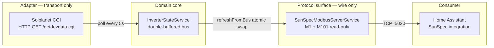

# Solar Home Gateway

A brand-agnostic **SunSpec Modbus TCP gateway** for the Solplanet ASW H-S2
series. Polls the inverter over HTTP CGI every 5 seconds and re-exposes the
readings as a SunSpec-conformant Modbus TCP server, so [Home
Assistant](https://www.home-assistant.io/)'s built-in SunSpec integration can
read it natively — no custom component required.

## Why

Most solar inverters ship with vendor-locked APIs. Solplanet is no exception:
its data lives behind an undocumented HTTP CGI endpoint. Re-publishing the
data over a standard, vendor-neutral protocol (Modbus + SunSpec) decouples
the inverter from the home-automation layer, so a future inverter swap is a
one-line config change instead of a Home Assistant rewrite.

## Architecture



The type system enforces the seams — `InverterAdapter.read()` returns
`Promise<InverterState>` and nothing else; `SunSpecModbusServerService` never
imports `@nestjs/axios`. The compiler rejects any future code that crosses
these lines.

## Quick path

1. `nvm use && corepack enable && pnpm install --frozen-lockfile`
2. `cp .env.example .env` and set `INVERTER_SN` (and override
   `INVERTER_BASE_URL` if your inverter is not at the default address).
3. `pnpm run start:dev` — the gateway binds Modbus on `:5020` and HTTP on
   `:3000`.
4. Verify: `curl http://localhost:3000/healthz` returns
   `{"status":"ok"}`. Point a Modbus client at `:5020` and read registers
   `40000–40123` (see [Verifying](#verifying)).

## Prerequisites

| Tool | Version | Notes |
|------|---------|-------|
| Node.js | ≥ 24 (per `.nvmrc`) | LTS — use `nvm` or `fnm` |
| pnpm | 11.x (pinned via `packageManager`) | `corepack enable` activates it |
| OS | macOS / Linux | Windows not tested; native build skipped via `optional=false` |

## Installation

```bash
nvm use                 # honour .nvmrc
corepack enable         # activate pnpm@11 from packageManager field
pnpm install --frozen-lockfile
```

The `optional=false` line in `.npmrc` skips the `modbus-serial` native
`serialport@13` build — the gateway uses TCP-only, so the native build would
just waste time and occasionally fail on macOS.

## Configuration

Copy `.env.example` to `.env` and edit. Every port is validated at boot —
out-of-range → the process crashes with a descriptive log line.

| Key | Default | Purpose |
|-----|---------|---------|
| `INVERTER_BASE_URL` | `http://192.168.1.50:8484` | CGI base; `getdevdata.cgi` appended by the adapter |
| `INVERTER_DEVICE_ID` | `2` | Solplanet device id (query param) |
| `INVERTER_SN` | `""` (required) | Inverter serial (query param) |
| `INVERTER_TIMEOUT_MS` | `4000` | CGI wall-clock budget |
| `POLL_INTERVAL_MS` | `5000` | Sched tick (decorator-fixed at 5 s in v1) |
| `POLL_TIMEOUT_MS` | `3000` | Adapter-internal abort |
| `MODBUS_HOST` | `0.0.0.0` | **Must be a private interface in production** |
| `MODBUS_PORT` | `5020` | Non-privileged |
| `MODBUS_UNIT_ID` | `1` | Modbus slave id (1..247) |
| `STALE_AFTER_MS` | `30000` | `snapshot()` stale threshold |
| `SHUTDOWN_TIMEOUT_MS` | `5000` | Graceful close budget |
| `HTTP_PORT` | `3000` | `/healthz` only |

> **Security note**: Modbus TCP has **no authentication and no encryption**.
> Anyone reachable on port 5020 can read (and, on a writeable gateway, set)
> the inverter state. Run the gateway on a trusted VLAN only; set
> `MODBUS_HOST` to a private interface in production (`192.168.1.x` or
> similar) and rely on network segmentation. Modbus TLS is out of scope
> for v1.

## Running

```bash
pnpm run start:dev     # ts-node, hot-reload disabled (transpile-only)
pnpm run build && pnpm run start   # compiled JS, production-style
```

Expected log line on first boot:

```
[Nest] ... LOG [Bootstrap] HTTP listening on :3000
[Nest] ... LOG [SunSpecModbusServerService] SunSpec Modbus TCP server bound to 0.0.0.0:5020 (unitID=1)
```

Without a real inverter, the cron will warn every 5 s — that's the adapter
returning the offline state, not a crash.

## Verifying

### 1. HTTP liveness

```bash
curl http://localhost:3000/healthz
# {"status":"ok"}
```

### 2. Modbus with `pymodbus`

```bash
python -m venv .venv && source .venv/bin/activate
pip install pymodbus==3.*
```

```python
from pymodbus.client import ModbusTcpClient
from pymodbus.payload import BinaryPayloadDecoder
from pymodbus.constants import Endian

c = ModbusTcpClient("127.0.0.1", port=5020)
c.connect()

# SunS magic at 40000-40001
suns = c.read_holding_registers(0, 2).registers
assert suns == [0x5375, 0x6E53], f"bad SunS magic: {suns!r}"

# M1 ID and L at 40002-40003
m1 = c.read_holding_registers(2, 2).registers
assert m1[0] == 1 and m1[1] == 68

# M101 ID and L at 40070-40071
m101 = c.read_holding_registers(70, 2).registers
assert m101[0] == 101 and m101[1] == 52

# M101.W (AC power, W) at 40084 with W_SF at 40085
w  = c.read_holding_registers(84, 2).registers
raw, sf = w[0], (w[1] - 0x10000) if w[1] > 0x7FFF else w[1]
print(f"AC power: {raw * 10**sf:.1f} W")

# M101.ST (operating state) at 40108
st = c.read_holding_registers(108, 1).registers[0]
# 1=OFF, 2=SLEEPING, 3=STARTING, 4=MPPT, 5=THROTTLED, 6=SHUTTING_DOWN, 7=FAULT, 8=STANDBY
print(f"Operating state: {st}")
```

## Home Assistant integration

Add the [SunSpec integration](https://www.home-assistant.io/integrations/sunspec/)
and point it at the gateway's host (`modbus:` → `host:` → port `5020`,
slave `1`). The corrected register map (verified against
[sunspec/models](https://github.com/sunspec/models)):

| Address | Field | Notes |
|---------|-------|-------|
| `40000`–`40001` | SunS magic (`0x5375 0x6E53`) | discovery sentinel |
| `40002`–`40069` | SunSpec Model 1 (Common, L=68) | vendor, model, serial, DA |
| `40070`–`40071` | Model 101 ID + L (101, 52) | single-phase inverter header |
| `40072` | A (AC current, A) | uint16 |
| `40076` | A_SF | signed int16 |
| `40080` | PhVphA (AC voltage phase A, V) | uint16 |
| `40083` | V_SF | signed int16 |
| `40084` | W (AC power, W) | int16 |
| `40085` | W_SF | signed int16 |
| `40086` | Hz (grid frequency, Hz) | uint16 |
| `40087` | Hz_SF | signed int16 |
| `40094`–`40095` | WH (lifetime energy, acc32 BE, Wh) | Wh — divide by 1000 for kWh |
| `40096` | WH_SF | signed int16 (typically 0) |
| `40108` | St (operating state) | enum16, 1..8 |

The Modbus address → buffer offset convention is `offset = register − 40000`.
`modbus-serial` v8 calls our handlers with the offset, so register `40084`
(W) is read as `getHoldingRegister(84)`.

## Security checklist

- [ ] `MODBUS_HOST` is set to a private interface (not `0.0.0.0`) in prod.
- [ ] The host running the gateway is on a trusted VLAN.
- [ ] Firewall blocks external traffic to `5020` and `3000`.
- [ ] `/healthz` is unauthenticated on purpose (liveness probes) — do not
      expose it to the public internet.

## Development

| Command | Purpose |
|---------|---------|
| `pnpm lint` | ESLint v9 flat config + typescript-eslint |
| `pnpm build` | `tsc -p tsconfig.json` (strict mode) |
| `pnpm test` | Jest unit suite (fake timers for the stale policy) |
| `pnpm test:e2e` | Boots the gateway, drives it via `modbus-serial` client |
| `pnpm run start:dev` | `ts-node` transpile-only, no hot reload |

CI runs `lint + build + test + test:e2e` on every PR via
`.github/workflows/ci.yml` (Node 24 from `.nvmrc`, pnpm 11 from
`packageManager`).

## Project layout

```
src/
├── main.ts                                # bootstrap
├── app.module.ts                          # ConfigModule + GatewayModule
├── config/
│   └── configuration.ts                   # typed env loader + port validation
├── gateway/
│   ├── gateway.module.ts                  # DI wiring
│   ├── inverter-polling.service.ts        # @Cron(EVERY_5_SECONDS)
│   └── inverters/
│       ├── inverter.adapter.ts            # abstract class + INVERTER_ADAPTER token
│       └── solplanet-cgi.adapter.ts       # @nestjs/axios → InverterState
├── state/
│   ├── inverter-state.types.ts            # InverterState, InverterStatus, M101_ST
│   └── inverter-state.service.ts          # double-buffered bus + stale policy
├── modbus/
│   ├── sunspec-modbus-server.service.ts   # IServiceVector + ServerTCP
│   ├── sunspec-registers.ts               # M1/M101 offsets, write helpers
│   └── scale-factor.ts                    # chooseScaleFactor / encode / splitAcc32
└── health/
    └── health.controller.ts               # GET /healthz
```

## License

MIT — see [LICENSE](./LICENSE).

## References

- Solplanet quick-installation / Modbus guide:
  `docs/QG0028_ASW6000-10000-S_EN_540-30170-03_V04_0723-2.pdf`
- SunSpec Information Model:
  <https://github.com/sunspec/models>
- Home Assistant SunSpec integration:
  <https://www.home-assistant.io/integrations/sunspec/>
- Modbus application protocol (v1.1b3):
  <https://modbus.org/docs/Modbus_Application_Protocol_V1_1b3.pdf>