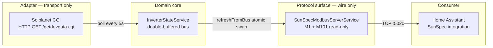

# Design: SunSpec Modbus Gateway

> **Phase**: sdd-design
> **Change**: `sunspec-modbus-gateway`
> **Inputs**: `proposal.md` (obs 578, `14a9833`), 9 spec files (obs 579, `4919f8b`), canonical register map (obs 575, topic `sunspec/register-map`), exploration (obs 577).
> **Author note**: The sdd-spec author flagged a perceived 2-register ambiguity in M1 layout. **Confirmed resolved below** — M1 body occupies offsets 4–69 (66 data regs: Mn=16 + Md=16 + Opt=8 + Vr=8 + SN=16 + DA=1 + Pad=1) plus a 2-register header (ID@2, L@3) for L=68 total. M101 starts at offset 70. The `Pad` register is canonical and required for even alignment.

## 1. Architecture overview

Three layers, decoupled by typed contracts. The Modbus server NEVER touches HTTP, and the adapter NEVER touches Modbus. The state bus is the only object either layer is allowed to touch.



Type-system enforces the seams: `InverterAdapter` exposes only `read(): Promise<InverterState>`; `SunSpecModbusServerService` exposes only Modbus handlers and never imports `@nestjs/axios`. The compiler will reject any future code that crosses these lines.

## 2. Module structure

Single root feature `GatewayModule` (arch-feature-modules) that imports `HttpModule`, `ScheduleModule`, and exposes the wiring. All providers are singletons (NestJS default).

```
GatewayModule
├── imports: HttpModule (register({ timeout: 4000, maxRedirects: 0 })), ScheduleModule.forRoot()
├── controllers: [HealthController] (/healthz)
└── providers:
    ├── InverterStateService                    (singleton, no lifecycle hooks)
    ├── SunSpecModbusServerService              (singleton, implements OnApplicationShutdown)
    ├── InverterPollingService                  (singleton, @Cron(EVERY_5_SECONDS))
    ├── SolplanetCgiAdapter                     (singleton, abstract class — bind to INVERTER_ADAPTER)
    └── { provide: INVERTER_ADAPTER, useClass: SolplanetCgiAdapter }
```

| Provider | Token | Scope | Hooks |
|----------|-------|-------|-------|
| `SolplanetCgiAdapter` | `INVERTER_ADAPTER` | singleton | none |
| `InverterStateService` | class | singleton | none |
| `SunSpecModbusServerService` | class | singleton | `OnModuleInit` (bind socket), `OnApplicationShutdown` (close, 5 s budget) |
| `InverterPollingService` | class | singleton | `@Cron(CronExpression.EVERY_5_SECONDS)` |
| `HealthController` | controller | request | `GET /healthz` |

`HttpModule` is registered explicitly with `timeout: INVERTER_TIMEOUT_MS` (default 4000) and `maxRedirects: 0` so a misconfigured inverter URL cannot hang the gateway or chase redirects off-LAN. `ConfigModule` is loaded globally by `AppModule.forRoot({ isGlobal: true })`.

## 3. Domain types — TypeScript signatures

`src/state/inverter-state.types.ts` — the contract that crosses every seam.

```ts
/** SunSpec operating state per sunspec/models model_101.json. */
export type InverterStatus =
  | 1   // OFF
  | 2   // SLEEPING
  | 3   // STARTING
  | 4   // MPPT — inverter is producing
  | 5   // THROTTLED
  | 6   // SHUTTING_DOWN
  | 7   // FAULT
  | 8;  // STANDBY

/** Canonical, immutable snapshot of the inverter at one moment in time. */
export interface InverterState {
  /** AC output power, W, 0..15000. */
  readonly acPowerWatts: number;
  /** AC phase-A voltage, V, 0..300. */
  readonly acVoltageVolts: number;
  /** AC current, A, 0..100. */
  readonly acCurrentAmps: number;
  /** Grid frequency, Hz, 45..65. */
  readonly gridFrequencyHz: number;
  /** Lifetime energy, kWh, int32 range (BE). Preserved on stale. */
  readonly lifetimeEnergyKwh: number;
  /** SunSpec operating state (1..8). OFF when stale. */
  readonly operatingState: InverterStatus;
  /** Vendor name, ≤ 32 chars, NUL-padded into Mn (M1). */
  readonly vendorName: string;
  /** Model name, ≤ 32 chars, NUL-padded into Md (M1). */
  readonly modelName: string;
  /** Serial number from config, ≤ 32 chars, NUL-padded into SN (M1). */
  readonly serialNumber: string;
  /** True when no fresh poll in > STALE_AFTER_MS. */
  readonly isStale: boolean;
  /** ms epoch, monotonically non-decreasing on success. 0 before first poll. */
  readonly lastUpdatedAt: number;
}

/** DI token so other modules depend on the interface, not the concrete class. */
export const INVERTER_ADAPTER = Symbol('INVERTER_ADAPTER');

/**
 * Abstract class (not TS interface) so NestJS DI ergonomics work without
 * an explicit factory. Concrete adapter is bound via `{ provide: INVERTER_ADAPTER, useExisting: SolplanetCgiAdapter }`.
 */
export abstract class InverterAdapter {
  abstract readonly vendorName: string;
  abstract readonly modelName: string;
  abstract read(): Promise<InverterState>;
}

/**
 * Map our domain InverterStatus → SunSpec M101 St enum. The numeric values
 * ARE the SunSpec enum — declared as a const enum so it inlines and erases.
 */
export const M101_ST = {
  OFF: 1,
  SLEEPING: 2,
  STARTING: 3,
  MPPT: 4,
  THROTTLED: 5,
  SHUTTING_DOWN: 6,
  FAULT: 7,
  STANDBY: 8,
} as const;
```

All numeric `InverterState` fields use SI base units. The scale-factor helpers in §4 produce the int16 wire encoding; this type never carries an `*_SF`.

## 4. Scale-factor math — concrete implementation

`src/modbus/scale-factor.ts` — pure, no NestJS or Node-imports beyond `Math`.

```ts
export interface Encoded { readonly value: number; readonly scaleFactor: number; }

/** SunSpec int16 range. */
const INT16_MAX = 32767;
const INT16_MIN = -32768;
const SF_FLOOR = -10;
const SF_CEIL = 10;

/**
 * Pick the SF that maximises precision without overflowing signed int16.
 * Prefers the SF closest to 0 that still keeps |round(v * 10^SF)| in range.
 * Always returns an SF in [SF_FLOOR, SF_CEIL]; clamps when even SF_FLOOR overflows.
 */
export function chooseScaleFactor(value: number, maxAbs: number = INT16_MAX): number {
  if (!Number.isFinite(value)) return 0;
  const abs = Math.abs(value);
  if (abs === 0) return 0;
  // Try SF from 0 outward; first SF where |v * 10^SF| > maxAbs wins as the floor.
  for (let sf = 0; sf >= SF_FLOOR; sf--) {
    const scaled = abs * Math.pow(10, -sf); // |v * 10^sf|
    if (scaled <= maxAbs) return sf;
  }
  return SF_FLOOR;
}

/** Apply SF to an engineering value, clamp into int16 range. */
export function applyScaleFactor(value: number, sf: number): number {
  const scaled = Math.round(value * Math.pow(10, sf));
  if (scaled > INT16_MAX) return INT16_MAX;
  if (scaled < INT16_MIN) return INT16_MIN;
  return scaled;
}

/** One-shot: pick SF and apply. */
export function encode(value: number): Encoded {
  const sf = chooseScaleFactor(value);
  return { value: applyScaleFactor(value, sf), scaleFactor: sf };
}

/** Split an unsigned 32-bit value into hi (offset+0) and lo (offset+1) uint16, big-endian. */
export function splitAcc32(value: number): { readonly hi: number; readonly lo: number } {
  const v = value >>> 0; // coerce to uint32
  const hi = (v >>> 16) & 0xffff;
  const lo = v & 0xffff;
  return { hi, lo };
}
```

Inline unit cases (reproduced verbatim in §11 test scaffold):

| Input | `chooseScaleFactor` | `encode` |
|-------|--------------------|----------|
| `0` | `0` | `{ value: 0, scaleFactor: 0 }` |
| `230.5` | `-1` | `{ value: 2305, scaleFactor: -1 }` |
| `4500` | `0` | `{ value: 4500, scaleFactor: 0 }` |
| `50000` | `1` | `{ value: 5000, scaleFactor: 1 }` (downgrade, never overflow) |
| `1e15` | `-10` | `{ value: 32767, scaleFactor: -10 }` (clamps to INT16_MAX) |
| `-100` | `0` | `{ value: -100, scaleFactor: 0 }` |
| `NaN` | `0` | `{ value: 0, scaleFactor: 0 }` |

`splitAcc32(12345)` → `{ hi: 0x3039, lo: 0x0000 }` — verified against the spec scenario "WH (lifetime energy) uses int32 BE, SF=0".

> **Endianness note (explicit)**: SunSpec is big-endian — high byte first for `acc32`, high register first for `int32`. `modbus-serial` v8 `setHoldingRegisters([hi, lo])` writes hi to the lower address, lo to the higher, matching BE on the wire. `setHoldingRegister` on a single uint16 writes the value as a BE uint16. Document this inline next to every write helper.

## 5. SunSpec register map — concrete implementation

`src/modbus/sunspec-registers.ts` — `as const` block mirroring obs 575 verbatim. All offsets are buffer offsets (register 40001 = offset 0).

```ts
/**
 * SunSpec Model 1 (Common) register map. L=68.
 * Header: ID=1 at +0, L=68 at +1, body at +2..+67.
 *   Mn    +2..+17  (16 regs = 32 chars)
 *   Md   +18..+33  (16 regs = 32 chars)
 *   Opt  +34..+41  ( 8 regs = 16 chars)
 *   Vr   +42..+49  ( 8 regs = 16 chars)
 *   SN   +50..+65  (16 regs = 32 chars)
 *   DA   +66       ( 1 reg)
 *   Pad  +67       ( 1 reg — canonical even-alignment pad)
 */
export const M1 = {
  ID: 0, L: 1,
  MN_START: 2, MN_END: 17,
  MD_START: 18, MD_END: 33,
  OPT_START: 34, OPT_END: 41,
  VR_START: 42, VR_END: 49,
  SN_START: 50, SN_END: 65,
  DA: 66,
  PAD: 67,
  LENGTH: 68,
} as const;

/**
 * SunSpec Model 101 (Single-Phase Inverter). L=52. Starts at absolute
 * buffer offset 70 (= 2 [SunS magic] + 68 [Model 1, L=68] — M1 starts at
 * offset 2 because SunS magic occupies offsets 0–1). Header: ID=101 at +0,
 * L=52 at +1, body at +2..+51 (50 data regs).
 *
 * Offsets verified against github.com/sunspec/models/json/model_101.json
 * and observation 575 (sunspec/register-map).
 */
export const M101 = {
  ID: 70,           // absolute offset = 2 (SunS) + 68 (M1, L=68)
  L: 71,            // +1
  A: 72,            // +2  AC current
  APHA: 73,         // +3  Phase A current
  APHB: 74,         // +4
  APHC: 75,         // +5
  A_SF: 76,         // +6  sunssf, shared by A/AphA/AphB/AphC
  PPVPHAB: 77,      // +7  Phase-to-phase voltage AB (0 in single-phase)
  PPVPHBC: 78,      // +8
  PPVPHCA: 79,      // +9
  PHVPHA: 80,       // +10 Phase-to-neutral voltage A
  PHVPHB: 81,       // +11
  PHVPHC: 82,       // +12
  V_SF: 83,         // +13 sunssf, SHARED by PhVph* and PPVph*
  W: 84,            // +14 AC power
  W_SF: 85,         // +15
  HZ: 86,           // +16 Frequency
  HZ_SF: 87,        // +17
  WH_HI: 94,        // +24 hi word of acc32 (lifetime energy)
  WH_LO: 95,        // +25 lo word
  WH_SF: 96,        // +26
  DCW: 99,          // +31 DC power
  DCA: 97,          // +27 DC current
  DCA_SF: 98,       // +28
  DCV: 100,         // +30 DC voltage (corrected — was 99 in v1 of this doc)
  DCV_SF: 101,      // +31 (corrected — was 99)
  TMPCAB: 101,      // +33 cabinet temp
  TMPSNK: 102,      // +34
  TMPTRNS: 103,     // +35
  TMPOT: 104,       // +36
  TMP_SF: 105,      // +37
  ST: 106,          // +38 operating state
  STVND: 107,       // +39
  EVT1: 108,        // +40 vendor event bitfield (bitfield32, 2 regs)
  EVT2: 110,        // +42
  EVT_VND1: 112,    // +44
  EVT_VND2: 114,    // +46
  EVT_VND3: 116,    // +48
  EVT_VND4: 118,    // +50
  LENGTH: 52,
} as const;

/** Layout constants for the double-buffer. */
export const SUNS_MAGIC_HI = 0x5375; // 'Su'
export const SUNS_MAGIC_LO = 0x6e53; // 'nS'
export const EOM_SENTINEL = 0xffff;
export const HOLDING_REGISTER_COUNT = 124; // 40000..40123
```

**Layout verification (closes spec-author ambiguity)**: M1 occupies offsets 0..67 (68 regs). M1 body (Mn..Pad) = 66 data registers (offsets 2..67) + 2-register header (ID, L). Sum of body fields: 16+16+8+8+16+1+1 = 66 ✓. M101 header at offset 68 (ID) and 69 (L), body at 70..121 = 52 regs ✓. EOM sentinel at offset 122. Total holding-register block 0..123 (124 regs). **No ambiguity — the `Pad` register is part of the M1 canonical layout.**

Register write helpers (`src/modbus/sunspec-registers.ts`):

```ts
/** Write a 16-bit unsigned value at offset. Writes BE uint16 (high byte first). */
export function writeUint16(buf: Buffer, offset: number, value: number): void {
  buf.writeUInt16BE(value & 0xffff, offset * 2);
}

/** Write an int32 BE across two consecutive registers: buf[off*2] = hi, buf[off*2+2] = lo. */
export function writeInt32BE(buf: Buffer, offset: number, value: number): void {
  buf.writeInt32BE(value | 0, offset * 2);
}

/**
 * Write an ASCII string into N registers (2 chars per register), big-endian per register,
 * NUL-padded. Always writes exactly `regCount` registers.
 */
export function writeSunSpecString(buf: Buffer, offset: number, value: string, regCount: number): void {
  const bytes = Buffer.alloc(regCount * 2, 0); // NUL-padded
  bytes.write(value.slice(0, regCount * 2), 0, regCount * 2, 'ascii');
  for (let i = 0; i < regCount; i++) {
    // modbus-serial treats each register as BE: high byte at lower address.
    buf.writeUInt16BE(bytes.readUInt16BE(i * 2), (offset + i) * 2);
  }
}
```

## 6. Double-buffer strategy

`SunSpecModbusServerService` owns the register block:

```ts
private readonly bufA: Buffer = Buffer.alloc(HOLDING_REGISTER_COUNT * 2);
private readonly bufB: Buffer = Buffer.alloc(HOLDING_REGISTER_COUNT * 2);
private active: 'A' | 'B' = 'A';

private getActive(): Buffer { return this.active === 'A' ? this.bufA : this.bufB; }
private getInactive(): Buffer { return this.active === 'A' ? this.bufB : this.bufA; }

/**
 * Called by InverterPollingService after publish(). Writes the new state
 * into the inactive buffer and atomically flips the active pointer.
 * Single-threaded JS makes the flip truly atomic.
 */
public refreshFromBus(state: InverterState): void {
  const target = this.getInactive();
  // ... write M101 dynamic block into `target` ...
  this.active = this.active === 'A' ? 'B' : 'A';
}
```

Modbus handlers read `getActive()` only. Because Node is single-threaded and `refreshFromBus` runs the flip as a single assignment after the buffer is fully written, a concurrent read either sees the entire pre-write block or the entire post-write block — never a torn mix.

**Why this matters**: Home Assistant's bulk read on first scan pulls M1 (68 regs) and M101 (52 regs) in two `getMultipleHoldingRegisters` calls, totalling 124 registers per scan. Without the swap, a partial write during the scan would let HA read a buffer where `Mn` is from one inverter poll and `SN` from another, or where `WH_SF` lags `WH`, yielding `NaN` or wildly wrong kWh in the Energy dashboard. The double-buffer trades two register-block allocations (~248 bytes) for a strict atomicity guarantee.

## 7. Async bulk-read handlers

`modbus-serial` v8 `IServiceVector` (verified interface from the v8.0.25 README):

```ts
import { ServerTCP, IServiceVector } from 'modbus-serial';

const vector: IServiceVector = {
  getHoldingRegister:        (addr: number): Promise<number> => { /* ... */ },
  getMultipleHoldingRegisters:(addr: number, length: number): Promise<number[]> => { /* ... */ },
  getInputRegister:          (addr: number): Promise<number> => { /* ... */ },
  setRegister:               (addr: number, value: number): Promise<void> => { throw new Error('read-only'); },
  setRegisterArray:          (addr: number, values: number[]): Promise<void> => { throw new Error('read-only'); },
  setCoil:                   (addr: number, value: boolean): Promise<void> => { throw new Error('read-only'); },
  getCoil:                   (addr: number): Promise<boolean> => { /* always false */ },
  readDeviceIdentification:  (): { /* SunSpec vendor block */ },
};

this.server = new ServerTCP(vector, { host: cfg.modbusHost, port: cfg.modbusPort, unitID: cfg.modbusUnitId });
```

Implementation:

```ts
getMultipleHoldingRegisters(addr: number, length: number): Promise<number[]> {
  const buf = this.getActive();
  const out = new Array<number>(length);
  for (let i = 0; i < length; i++) out[i] = buf.readUInt16BE((addr + i) * 2);
  return Promise.resolve(out);
}

getHoldingRegister(addr: number): Promise<number> {
  return Promise.resolve(this.getActive().readUInt16BE(addr * 2));
}
```

Two `getMultipleHoldingRegisters` round-trips cover HA's first scan (M1 + M101); subsequent scans reuse cached registers on HA's side and only re-poll dynamic M101 fields.

## 8. Polling service

`src/gateway/inverter-polling.service.ts`:

```ts
@Injectable()
export class InverterPollingService {
  private readonly logger = new Logger(InverterPollingService.name);

  constructor(
    @Inject(INVERTER_ADAPTER) private readonly adapter: InverterAdapter,
    private readonly bus: InverterStateService,
    private readonly modbus: SunSpecModbusServerService,
  ) {}

  @Cron(CronExpression.EVERY_5_SECONDS)
  async handleTick(): Promise<void> {
    try {
      const state = await this.adapter.read();
      this.bus.publish(state);
      this.modbus.refreshFromBus(state);
    } catch (err) {
      // Adapter is contractually required not to throw; this catch is belt-and-braces.
      this.logger.warn(`poll tick failed: ${(err as Error).message}`);
    }
  }
}
```

The cron is the only caller of `adapter.read()`, `bus.publish()`, and `modbus.refreshFromBus()`. The three calls are sequential — no concurrency — so the swap always reflects a fully-written buffer. `@nestjs/schedule` runs the handler in its own scheduler; a thrown error would be rethrown into the scheduler, which is why the catch wraps the entire body.

## 9. Stale-data handling

`InverterStateService` thresholds:

- `STALE_AFTER_MS = 30000` (configurable via `.env`, `[5000, 300000]`).
- `publish(state)` records `lastUpdatedAt` if `!state.isStale`. If `state.isStale` (adapter returned offline), do NOT advance `lastUpdatedAt`.
- `snapshot()` returns:
  - if `Date.now() - lastUpdatedAt < STALE_AFTER_MS`: the published state.
  - else: `{ ...lastGood, acPowerWatts: 0, acVoltageVolts: 0, acCurrentAmps: 0, gridFrequencyHz: 0, operatingState: 1, isStale: true }` — preserving `lifetimeEnergyKwh`, `vendorName`, `modelName`, `serialNumber`.

This avoids HA's "phantom power" pattern at night and during inverter reboot. When the sun returns, the next successful poll returns `isStale=false` and the bus returns to live data without manual intervention.

## 10. Configuration schema

`src/config/configuration.ts` — single typed loader.

| Key | Type | Default | Notes |
|-----|------|---------|-------|
| `INVERTER_BASE_URL` | `string` | `http://192.168.1.50:8484` | CGI base; `getdevdata.cgi` appended in adapter |
| `INVERTER_DEVICE_ID` | `string` | `2` | Solplanet device id |
| `INVERTER_SN` | `string` | `""` (required) | Inverter serial, ≤ 32 chars |
| `INVERTER_TIMEOUT_MS` | `number` | `4000` | Axios timeout |
| `POLL_INTERVAL_MS` | `number` | `5000` | Sched tick (decorator-fixed at 5 s in v1) |
| `POLL_TIMEOUT_MS` | `number` | `3000` | Adapter-internal abort |
| `MODBUS_HOST` | `string` | `0.0.0.0` | Bind address; **must be private IP in prod** |
| `MODBUS_PORT` | `number` | `5020` | Non-privileged |
| `MODBUS_UNIT_ID` | `number` | `1` | Modbus slave id |
| `STALE_AFTER_MS` | `number` | `30000` | `snapshot()` threshold |
| `SHUTDOWN_TIMEOUT_MS` | `number` | `5000` | Graceful close budget |
| `HTTP_PORT` | `number` | `3000` | `/healthz` only |

Validation: every port-valued key validated against `[1, 65535]` at boot; out-of-range → exit `1` with a descriptive log line (per `configuration.md` spec).

> **Security note (must appear in README)**: Modbus TCP has **no authentication and no encryption**. Anyone reachable on port 5020 can read the inverter state. Run the gateway on a trusted VLAN only; the default `MODBUS_HOST=0.0.0.0` is for development. In production set `MODBUS_HOST=192.168.1.x` (private interface) and rely on network segmentation. Modbus TLS is out of scope for v1.

## 11. Test strategy

| Layer | File | Tooling | What it proves |
|-------|------|---------|----------------|
| Unit | `test/unit/scale-factor.spec.ts` | Jest | `chooseScaleFactor` table (0, ±100, 230.5, 4500, 50000, 1e15, NaN); `applyScaleFactor` clamps; `encode` round-trips |
| Unit | `test/unit/scale-factor.spec.ts` | Jest | `splitAcc32` for 12345, 0, 2^32-1, 2^31; verifies hi=high-word, lo=low-word |
| Unit | `test/unit/inverter-state.service.spec.ts` | Jest + fake timers | cold-start defaults; 30 s threshold; preserves `lifetimeEnergyKwh` on stale; preserves last-good across offline publish |
| Unit | `test/unit/sunspec-modbus-server.service.spec.ts` | Jest | double-buffer swap is atomic; `getMultipleHoldingRegisters(0,124)` returns full SunSpec magic + EOM sentinel; `getHoldingRegister` resolves from active buffer only |
| Integration | `test/integration/solplanet-cgi.adapter.spec.ts` | Jest + `nock` | HTTP 502 → offline state; JSON parse error → offline state; non-numeric → coerced to safe defaults |
| E2E | `test/e2e/sunspec-modbus.e2e-spec.ts` | Jest + `pymodbus` (Python) | Boot the gateway, connect `pymodbus.client.sync.ModbusTcpClient('localhost', 5020)`, read 40000–40001 (SunS magic), read M1 (40002–40069), read M101 dynamic block (40084, 40080, 40072, 40086, 40094–40095, 40108), decode with `convert_from_registers`, assert against injected state |

`pymodbus` is **not** an npm dependency — it runs only in `sdd-verify` against a Python venv, documented in the README. `nock` intercepts the adapter's HTTP at the test boundary, so no live inverter is required for CI.

## 12. File structure

```
src/
├── main.ts
├── app.module.ts
├── config/
│   └── configuration.ts
├── gateway/
│   ├── gateway.module.ts
│   ├── inverter-polling.service.ts
│   └── inverters/
│       ├── inverter.adapter.ts          (abstract class + INVERTER_ADAPTER token)
│       └── solplanet-cgi.adapter.ts
├── state/
│   ├── inverter-state.types.ts          (InverterState, InverterStatus, InverterAdapter, INVERTER_ADAPTER, M101_ST)
│   └── inverter-state.service.ts
├── modbus/
│   ├── sunspec-modbus-server.service.ts
│   ├── sunspec-registers.ts              (M1, M101, writeUint16, writeInt32BE, writeSunSpecString)
│   └── scale-factor.ts                   (chooseScaleFactor, applyScaleFactor, encode, splitAcc32)
└── health/
    └── health.controller.ts              (GET /healthz)
test/
├── unit/
│   ├── scale-factor.spec.ts
│   ├── inverter-state.service.spec.ts
│   └── sunspec-modbus-server.service.spec.ts
├── integration/
│   └── solplanet-cgi.adapter.spec.ts    (uses nock)
└── e2e/
    └── sunspec-modbus.e2e-spec.ts        (spawns gateway, talks via pymodbus)
```

## 13. Dependencies (pinned)

**Package manager**: `pnpm@11.0.0` (pinned in `package.json` via the
`packageManager` field; enforced by `corepack`). Rationale:
- Deterministic installs via `pnpm-lock.yaml` (no `package-lock.json`
  coexistence).
- Faster CI cache hits — `actions/setup-node` `cache: pnpm` warms
  the pnpm store directly.
- Stricter peer-dep resolution surfaces mismatch bugs that npm's
  permissive install masks.

**`.npmrc` flags**:
- `shamefully-hoist=true` — required because NestJS packages transitively
  import hoisted deps that pnpm's default isolated layout breaks.
- `strict-peer-dependencies=false` — pnpm's default is too strict for
  NestJS's loose peer declarations.
- `auto-install-peers=true` — peers are installed automatically instead
  of failing the install.
- `optional=false` — skips `modbus-serial`'s optional `serialport@13`
  native build; TCP-only path is sufficient.

**Production** (added to `package.json`):
- `@nestjs/common` `^11.x`
- `@nestjs/core` `^11.x`
- `@nestjs/config` `^4.x`
- `@nestjs/axios` `^4.x`
- `@nestjs/schedule` `^6.x`
- `axios` `^1.x` (peer of `@nestjs/axios`)
- `modbus-serial` `8.0.25` (pinned — see obs 577)
- `reflect-metadata` `^0.2.x`
- `rxjs` `^7.x`

**Dev**:
- `typescript` `^5.x`
- `ts-node` `^10.x`
- `@types/node` `^20.x`
- `jest` `^29.x`, `ts-jest` `^29.x`, `@types/jest` `^29.x`
- `eslint` `^9.x`, `@eslint/js` `^9.x`, `typescript-eslint` `^8.x`
  (ESLint flat config + TS preset)
- `nock` `^14.x`
- `supertest` `^7.x`

**Verify harness (NOT an npm dep — Python venv, listed in README setup)**:
- `pymodbus` `^3.x` — runs only in `sdd-verify`, never in CI unit pipeline.

Install `modbus-serial` with `--no-optional` to skip the `serialport@13` native build (TCP-only path is sufficient). Document this in the README so contributors don't fight the postinstall on Mac/Linux.

### 14.5 CI/CD — GitHub Actions

CI runs on every PR and on every push to `main` (`.github/workflows/ci.yml`):

| Step | Tool | Purpose |
|------|------|---------|
| checkout | `actions/checkout@v4` | shallow clone |
| setup-node | `actions/setup-node@v4` with `node-version: 20`, `cache: pnpm` | warm pnpm store |
| corepack | `corepack enable pnpm` | activate pnpm from `packageManager` field |
| install | `pnpm install --frozen-lockfile` | deterministic dep resolution |
| lint | `pnpm lint` | ESLint v9 flat config |
| build | `pnpm build` | TypeScript strict compile |
| test | `pnpm test -- --coverage` | Jest unit + integration |

`runs-on: ubuntu-latest`, `timeout-minutes: 10`. The pnpm version is
not hard-coded in the workflow — `corepack` reads the `packageManager`
field from `package.json`, so a single bump there propagates everywhere.

**Node version requirement**: `engines.node: ">=20"` (declared in
`package.json`). LTS 20 is the floor; 22/24 also work for local dev.

## 14. Forecasted line count

| Component | LOC (incl. doc comments) |
|-----------|--------------------------|
| Domain + adapter interface (`inverter-state.types.ts`) | 60 |
| Solplanet adapter (`solplanet-cgi.adapter.ts`) | 120 |
| State bus (`inverter-state.service.ts`) | 50 |
| Scale-factor helpers (`scale-factor.ts`) | 40 |
| Register constants + write helpers (`sunspec-registers.ts`) | 120 |
| Modbus server (`sunspec-modbus-server.service.ts`) | 180 |
| Polling service (`inverter-polling.service.ts`) | 40 |
| Module wiring + config + `main.ts` | 60 |
| Health controller | 20 |
| Unit tests (3 files) | 150 |
| Integration tests (`nock`) | 80 |
| E2E tests (pymodbus) | 100 |
| **Total** | **~1020** |

**Of which ~150 is doc/JSDoc comments. Effective code-only LOC ≈ 870.**

This is **above the D1 400-line review budget**. Per preflight `C1` (ask on risk) and the `chained-pr` skill, I cannot decide between `size:exception` and chained-PR slicing. Surfacing the decision to the orchestrator.

## 15. Review budget decision (BLOCKER)

Forecasted `~1020 LOC` (effective code ~870) exceeds the 400-line D1 budget. The user pre-approved chained PRs (preflight C1 = `ask-on-risk`, already triggered) and chose chained-PRs over `size:exception` because each slice has an autonomous verification gate and a clean rollback boundary.

**Delivery flow: GitHub Flow.** Each PR targets `main` directly (no
parent chain, no tracker branch). PR2 and PR3 are developed in parallel
off `main` after PR1 merges; both depend on PR1's foundation being in
`main`, but neither depends on the other.

**Branch graph (three PRs against `main`):**

```
main ◄── pr1/domain-state-scalefactor   (PR1 — foundation: types, bus, scale-factor, pnpm, ESLint, CI)
main ◄── feat/modbus-server-registers   (PR2 — Modbus wire + e2e, branches off main after PR1 merges)
main ◄── feat/solplanet-adapter-module  (PR3 — HTTP adapter + wiring + README, branches off main after PR1 merges)
```

**Branch naming**: `feat/<scope>` for feature PRs (GitHub Flow
convention). The PR1 branch keeps its `pr1/...` name because the PR is
already open at the time of writing — renaming would invalidate the
PR URL. PR2 and PR3 use the `feat/` prefix.

**Per-PR slices** (autonomous scope, clear verification gate, clean
rollback boundary):
- **PR1 — Domain + Adapter interface + State bus + Scale-factor helpers + Unit tests + pnpm + ESLint + CI** (~350 LOC). Verifies the typed contract end-to-end with a `FakeAdapter` and pure helpers. Tests run with zero external dependencies. Establishes the InverterState type and bus atomic-swap pattern. Adds the pnpm migration, ESLint v9 flat config, and GitHub Actions CI workflow.
- **PR2 — Modbus server + Register constants + E2E test** (~400 LOC). Branches off `main` after PR1 merges. Verifies the wire format and double-buffer against `pymodbus`. No live inverter needed.
- **PR3 — Solplanet adapter + Polling cron + Module wiring + Config + README** (~350 LOC). Branches off `main` after PR1 merges. Independent of PR2. Plugs the real HTTP transport into the bus. Verifies against the real inverter manually.

`work-unit-commits` skill encodes the commit-per-PR discipline this
requires. The `chained-pr` skill is NOT used — GitHub Flow replaces it.
